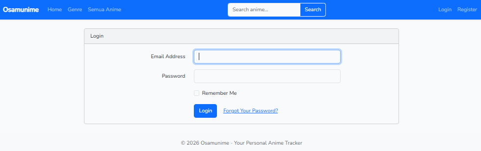
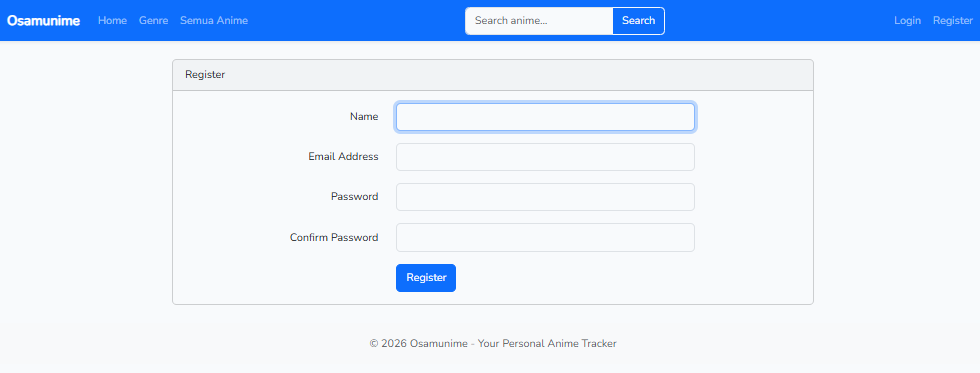

# Osamunime - Aplikasi Manajemen Anime Favorit

## Nama & NIM Mahasiswa

-   **Nama:** HISYAM EKA PRAMUDITA
-   **NIM:** 2307016

## Teknologi yang Digunakan

-   **Backend:** Laravel 12.x (PHP Framework)
-   **Frontend:** Bootstrap 5, JavaScript
-   **Database:** MySQL (lokal & produksi)
-   **API:** Jikan API (untuk data anime)
-   **Build Tool:** Vite
-   **Server:** Apache/Nginx
-   **Bahasa Pemrograman:** PHP 8.2+, JavaScript

## Cara Instalasi dan Menjalankan Aplikasi

### Prasyarat

-   PHP 8.2 atau lebih tinggi
-   Composer
-   Node.js dan npm
-   MySQL (untuk lokal dan produksi)

### Instalasi

1. Clone repository ini:

    ```bash
    git clone <url-repository>
    cd Osamunime-App
    ```

2. Install dependensi PHP:

    ```bash
    composer install
    ```

3. Copy file environment dan atur konfigurasi:

    ```bash
    copy .env.example .env
    ```

4. Generate application key:

    ```bash
    php artisan key:generate
    ```

5. Install dependensi JavaScript:

    ```bash
    npm install
    ```

6. Build asset frontend:

    ```bash
    npm run build
    ```

7. Jalankan migrasi database:
    ```bash
    php artisan migrate
    ```

8. Konfigurasi database MySQL di file .env (pastikan DB_CONNECTION=mysql, DB_HOST=127.0.0.1, DB_PORT=3306, DB_DATABASE=osamunime_db, DB_USERNAME=root, dan DB_PASSWORD sesuai dengan pengaturan MySQL Anda).

9. Pastikan layanan MySQL aktif (misalnya melalui Laragon/XAMPP) sebelum menjalankan migrasi.

10. Jalankan migrasi database untuk membuat tabel-tabel yang diperlukan di database `osamunime_db`.

### Menjalankan Aplikasi

1. Jalankan development server:

    ```bash
    php artisan serve
    ```

2. Buka browser dan akses `http://localhost:8000`

### Untuk Development (dengan hot reload)

1. Buka terminal/command prompt pertama dan jalankan server Laravel:

    ```bash
    php artisan serve
    ```

2. Buka terminal/command prompt kedua dan jalankan Vite watcher untuk hot reload CSS/JS:
    ```bash
    npm run dev
    ```

## Fitur Utama

-   Menampilkan daftar anime dari API eksternal (Jikan API)
-   Menyimpan anime sebagai favorit
-   Menambahkan rating dan review untuk anime favorit
-   Menyaring dan mengurutkan anime favorit
-   Sistem tagging untuk anime favorit
-   Responsive design untuk berbagai ukuran layar

## Tangkapan Layar (Screenshot)

### Halaman Utama


### Detail Anime


### Halaman My Favorite


### Form Edit Favorite


### Halaman Genre


### Halaman Login


### Halaman Register


## Kontribusi

Kontribusi sangat diterima! Silakan fork repository ini dan buat pull request untuk perubahan yang ingin ditambahkan.

## Catatan Penting untuk Penggunaan Aplikasi

Namun, ada beberapa hal yang perlu diperhatikan agar aplikasi bisa digunakan sepenuhnya:

1. **Database lokal** - Aplikasi ini sekarang dikonfigurasi untuk menggunakan MySQL sebagai database utama. Database yang digunakan bernama `osamunime_db` dan dapat diakses melalui phpMyAdmin.

2. **API key** - Aplikasi ini menggunakan Jikan API untuk mengambil data anime. Umumnya Jikan API tidak memerlukan API key untuk penggunaan dasar, namun pembatasan rate limit mungkin berlaku.

3. **Koneksi internet** - Karena aplikasi mengambil data dari API eksternal, koneksi internet diperlukan untuk menampilkan informasi anime secara lengkap.

4. **Akses database** - Untuk melihat data pengguna, favorit, dan tag secara langsung, Anda dapat mengakses database `osamunime_db` melalui phpMyAdmin di `http://localhost/phpmyadmin`.

## Lisensi

Proyek ini dilisensikan di bawah lisensi MIT.

## Akses Aplikasi

- **Aplikasi Web**: `http://localhost:8000`
- **Database (phpMyAdmin)**: `http://localhost/phpmyadmin` (database: `osamunime_db`)
- **API Jikan**: Otomatis digunakan untuk mengambil data anime dari `https://api.jikan.moe/v4`
